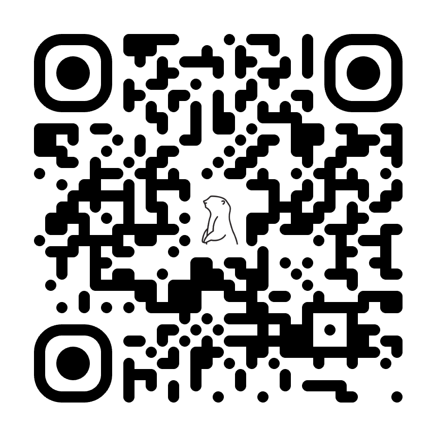
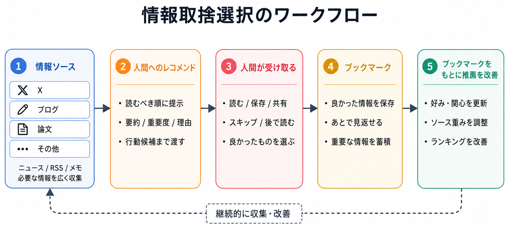
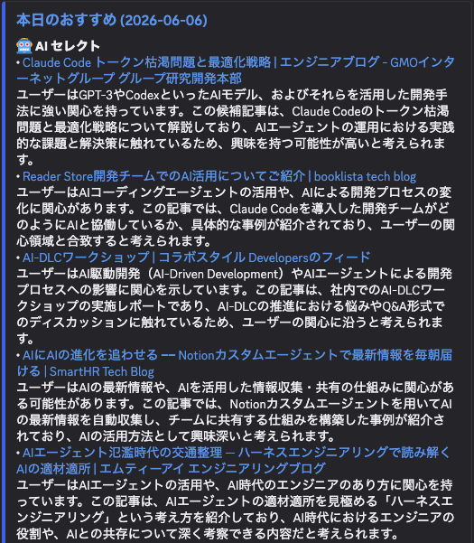

<!-- _class: cover -->
<!-- _header: "" -->
<!-- _paginate: false -->

# AI時代に改めて情報との向き合い方を考える

第7回それいけ。AI ～仙台のLT会

---

<!-- _class: profile -->

## 自己紹介

**名前：** 伊藤健治(@sori883)
**所属：** 株式会社エーピーコミュニケーションズ

---

<!-- _class: section-divider -->
<!-- _header: "" -->
<!-- _paginate: false -->

## AI情報、溢れすぎ＆移り変わり早すぎ問題
---

## AI情報、溢れすぎ＆移り変わり早すぎる問題

### SNSを開けば、日々新しい情報に溢れている
- 新しいモデル、ツールのリリース
- 「〇〇はもう時代遅れ！これからは〇〇！！」という煽り

### 数日後にはベストプラクティスが移り変わっている
- ちょっと前は「Claude Codeが最強！」 
- 1か月もしないうちに「Codexが最強！」
- 今は「両方組み合わせることが当たり前！！」
  
**→ 出遅れたくないので追ってしまう**
**→ 一方で、闇雲に情報を追うことが非効率**
**→ 情報の取捨選択が必要**

---

<!-- _class: section-divider -->
<!-- _header: "" -->
<!-- _paginate: false -->

## 何を考えて情報を取捨選択するか

---

## 何を考えて情報を取捨選択するか

### 何を解決したいかで見極める

- AIで何ができるかではなく、AIで何を解決できるかを考える
  - 出発地点は人間のお悩み事
  - AIで目の前の問題を解決できるか

### コア情報なのか、流行りなのか見極める

- SNSのバズに左右されず、長期的な視点でコア情報を見る
  - AIに何をどう任せるか、どのような成果につながるか  

**→ 合致する情報だけに注力して手を動かす**

---

<!-- _class: section-divider -->
<!-- _header: "" -->
<!-- _paginate: false -->

## 情報の取捨選択にもAIを活用して楽をしよう

---

<!-- _class: recommend-workflow -->

## 情報の取捨選択にもAIを活用して楽をしよう

- 情報をAIに渡してレコメンドしてもらう
- レコメンドした情報はブックマークして人間とAIが後で読み返せるようにする
- ブックマーク等の取捨選択観点をもとにレコメンドを継続改善

  
  

---

<!-- _class: section-divider -->
<!-- _header: "" -->
<!-- _paginate: false -->

## まとめ

---

<!-- _class: recommend-workflow -->

## まとめ

- 一過性の流行りに振り回されない！
- 目的を明確にしてから情報を追う
  - 目の前の問題解決
  - その他いろいろ..
- AIで解決した問題は発信しよう！

---

<!-- _class: section-divider -->
<!-- _header: "" -->
<!-- _paginate: false -->

## ご清聴ありがとうございましたm(_ _)m
